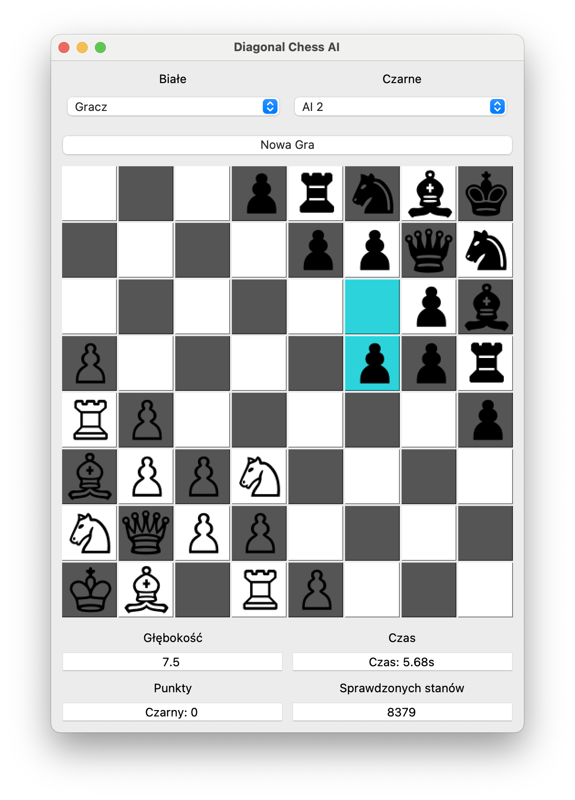

# Diagonal Chess



To jest aplikacja, która pozwala na rozegranie partii szachów na planszy o rozmiarze 8x8, na której bierki są ułożone na przekątnych.

## Instalacja

Aby zainstalować moją aplikację, wykonaj następujące kroki:

1. Sklonuj repozytorium na swój lokalny komputer:

   ```bash
   git clone https://github.com/rafafau/diagonal-chess.git
    ```

2. Wejdź do folderu z aplikacją:
    
   ```bash
   cd diagonal-chess
    ```

3. Zainstaluj wymagane biblioteki:

   ```bash
   pip install -r requirements.txt
    ```

4. Uruchom aplikację:
    
   ```bash
   python3 main.py
    ```
